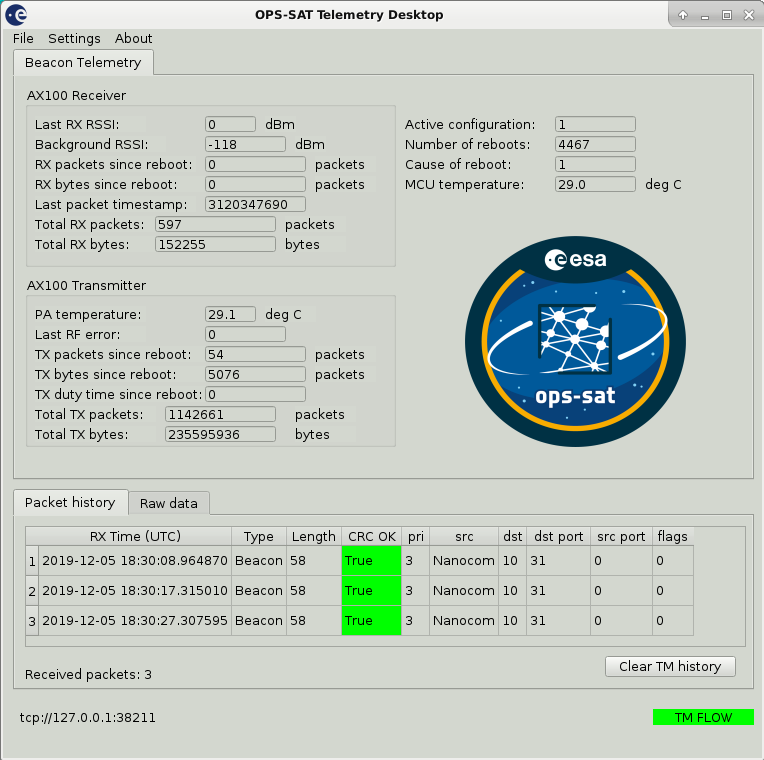

# gr-opssat

Authors: Fischer Benjamin (benjamin.fischer@esa.int), Tom Mladenov (tom.mladenov@esa.int)

This repository contains documentation, and applications for receiving, demodulating, and decoding the UHF signal transmitted by the ESA OPS-SAT mission. It also contains a full graphical application for viewing and parsing the beacon frames transmitted by OPS-SAT.

https://opssat1.esoc.esa.int/

https://www.esa.int/Our_Activities/Operations/OPS-SAT

## Overview

### UHF specifications
Can be found in docs/os-uhf-specs.pdf

### Applications
1. UHF receiver application (apps/os_uhf_rx.grc)
    1. Offset sampling
    2. Doppler compensation (with GPredict)
    3. Frequency shifting to baseband and downsampling
    5. Noise suppressor (Squelch)
    4. ZMQ sink
2. OPS-SAT demodulator and decoder (apps/os-demod-decode.grc)
    1. ZMQ source
    2. GMSK demodulator
    3. Decoder
    5. Output: Payload frame
3. OPS-SAT UHF Desktop (apps/desktop/main.py)
    1. Written in Python 3
    2. Uses a ZMQ subscriber to get data from GR flowgraph (apps/os-demod-decode.py)
    3. Parses, and views beacon content fields in engineering values
    
### Dependencies
1. UHF receiver application (os_uhf_rx.grc)
    1. https://github.com/wnagele/gr-gpredict-doppler
2. OPS-SAT demodulator and decoder (os-demod-decode.grc)
    1. https://github.com/daniestevez/gr-satellites
3. OPS-SAT UHF Desktop (apps/desktop/main.py)
    1. Python 3
    1. https://pypi.org/project/PyQt5/
    2. https://pypi.org/project/pyzmq/
    3. https://pypi.org/project/crccheck/
    
### Recordings
A clean recording of the NanoCom AX100 beacon can be found in recordings/


## Getting started

Install all dependencies for the grc flowgraphs and the GUI Desktop application.
For initial testing purposes, you can unzip the beacon recording and make the file source block in os_uhf_rx.grc point to the
unzipped .cf32 file. Regenerate the python code from gnuradio-companion.

Run the receiver flowgraph:
```
python apps/os_uhf_rx.py
```

Then start the demodulator/decoder:
```
python apps/os-demod-decode.py
```
You should now see PDU's being printed in the terminal of the demodulator application every 10 seconds.

To parse and view the beacon contents, the OPS-SAT desktop application can be started with:
```
python3 apps/desktop/main.py
```

It receives the RS decoded CSP packet + 4 byte CRC32-C over a ZMQ socket on localhost port 38211 to which it is subscribed.
You should now see beacon frames being parsed and displayed:



The raw packet history shows the received packets, CRC check status and CSP header information.

This application writes to 2 logfiles in apps/desktop/log:
* One log contains the beacon hex data (beacon.log)
* The other log contains timestamped events (gui_event.log)

The GUI desktop application does not need to be running for the system to operate, i.e. the receiver application and demodulator application can operatate standalone. The GUI desktop is merely meant for parsing and viewing AX100 beacon contents.


## Operational usage
For operational usage, the device source blocks should be used instead of a file source block.

Doppler offsets are fed to the os_uhf_rx.py flowgraph using gr-predict which runs over 2 local ports.
To configure the frequency correction, you can follow the intructions at: https://github.com/wnagele/gr-gpredict-doppler
For OPS-SAT, the nominal downlink frequency should be configured for 437.2 MHz


Once it is known which of the pre-assigned NORAD IDs of Arianespace launch VS23 belongs to OPS-SAT, the currently disabled
telemetry forwarder block in os-demod-decode.grc can be used to forward telemetry to various servers such as SatnogsDB.


